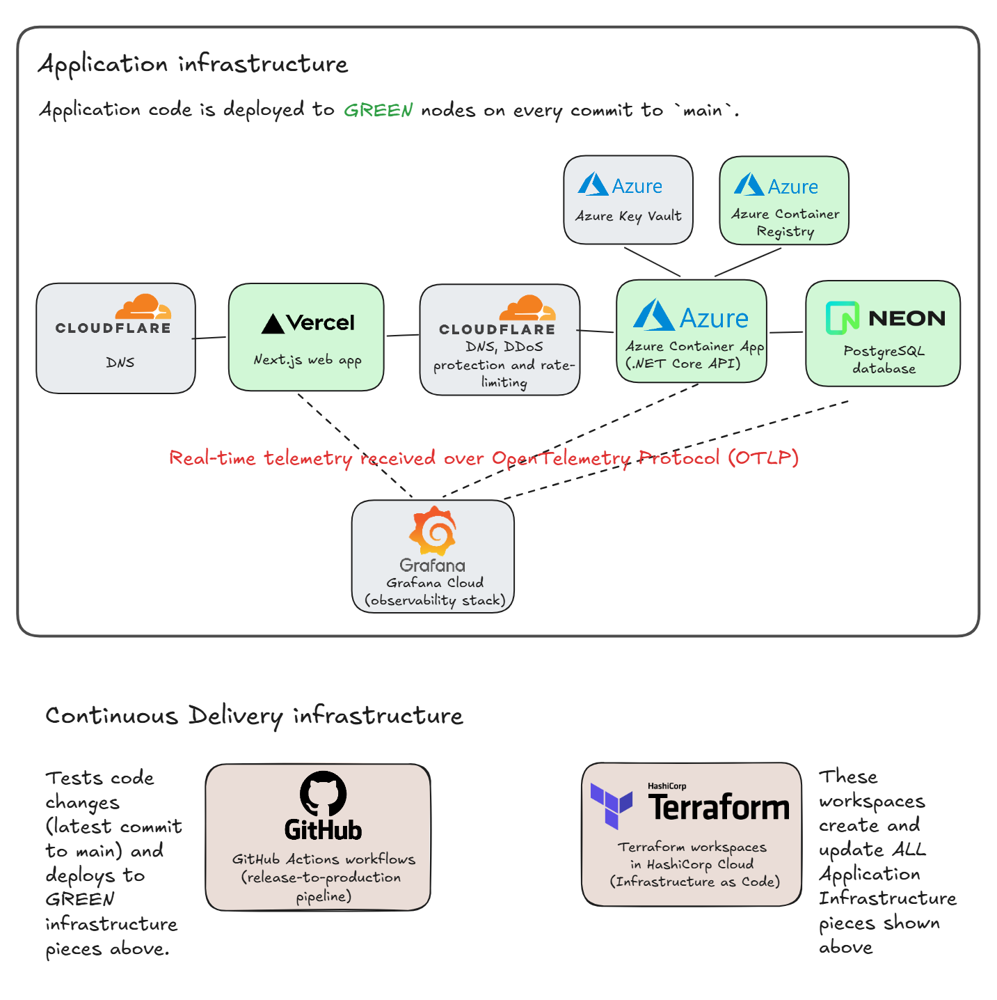

## Overview

## Architecture

## Configuration

For details of configuration key/value pairs that need to be provided to each service, and how these may be provided - e.g. using config files in local development but environment variables at build and/or run of deployment or containers - see the READMEs of respective services ([frontend app](./flowmazonfrontend/README.md) and [backend api](./flowmazonbackend/flowmazonapi/README.md)).

For environment-specific sources of configuration data, see [Environments](#environments) section below.

## Environments

Following environments are set up to run app and/or tests.

### Environment 1: Local Fullstack Debugging

Use VS Code compund launch configuration **Frontend/Backend** to run in debug mode. Just select from launch configurations dropdown it in Debug sidebar window (Ctrl), then whenever you upress F5, the configuration will launch.

Bear in mind that to stop debugging with this compound configuration, you will need to press Shift+F5 twice and not once.

The compound launch configuration is defined in `compounds` key and the individual configurations it is composed of are defined in `configurations` key in `.vscode/launch.json`.

The database this launch configuration (and quite possibly every VS Code launch configuartion) uses is `FlowmazonDB` running on a PostgreSQL database server running on the local machine.

**Configuration:** Values for required and some optional configuration keys are specified as follows:

- In each of the two launch configurations - `.NET Core: debug in full stack` and `Next.js: debug in full stack` - that make up the compound launch configuration, there is an `env`object that provides values of some required and/or optional configuration keys for the corresponding app.

- Value `ConnectionStrings__FlowmazonDB` key's value is taken from .NET User Secrets Manager which stores it in a file at path `%APPDATA%\Microsoft\UserSecrets\<user_secrets_id>\secrets.json` where `user_secrets_id` is given in property `<UserSecretsId>` in [flowmazonapi.csproj](./flowmazonbackend/flowmazonapi/flowmazonapi.csproj).
  User Secrets Manager may also be used for storing other development time secrets in the future.

- For ASP.NET Core app, some settings are being taken from `appSettings.json` and `appSettings.Development.json` (the latter applies, and overrides what is in `appSettings.json`, because the app is launched in `Development` environment by the launch configuration).
  The settings configured in these config files are **currently all optional and not very important:** `AllowedHosts: "*"`- which means there is no host filtering at all, this is the default anyway - and Log Levels for some namespaces. **These were all part of scaffolded config files; I haven't changed these files at all**.

### Environment 2: Manual Execution of a Playwright test

You can run or debug one or more Playwright tests from Testing sidebar (where Playwright tests in the workspace are made available by the Playwright extension) or from UI Mode.

**Configuration:** Both the tests and starting the app under test are fully configured in `flowmazonfrontend/playwright.config.ts`. Two bits are relevent:

- `use.baseURL` sets the base URL for pages against which tests would be run (e.g. the baseURL in statement `await page.goto('/add-product');`).

- Configuration of app-under-test, done via `webServer` element in the config file, is exactly the same as that for full-stack`Frontend/Backend` launch configuration above. In particular:

  - The connection string is still taken from .NET User Secrets Manager.
  - The same (unimportant in my view) settings for .NET Core API are in `appSettings.json` and `appSettings.Development.json`.
  - All settings configured in the launch configurations that are part of `Frontend/Backend` compound configuration are also configured here, except that in order to set them as environment variables, I use `cross-env` NPM pacakge here but used `env` object in the launch configurations.

  The reason is that `webServer` is set so that it starts the app (in non-debug mode) if not already running. So if it is already running - which it would be if you launched `Frontend/Backend` launch configuration above for full-stack debugging - then Playwright tests are run against the app under the same configuration as when Playwright has to start it itself. **See below for more details**.

**Debugging app-under-test during test execution:** Debugging a test does NOT run the app under test in debug mode or attach to it, so any breakpoints in the app under test would NOT get hit. If you want to debug the app under test while running or debugging a test, the simplest solution that comes to mind would be to:

1. Open up the workspace again in another instance of VS Code
2. In this new instance of VS Code, launch the app using `Frontend/Backend` compound launch configuration described above
3. Launch a test - run it or debug it - in the original instance of VS Code.

### Local Continuous Testing

Each of the following test suites is run continuously in VS Code:

- Storybook unit tests for components in the Next.js app
- Playwright integration tests (end-to-end tests) run against the Next.js app that is running toghether with the backend .NET Core API and a PostgreSQL test database
- Intergation tests of the .NET Core API

For each of these suites, a task in `tasks.json` starts on `folderOpen` which in turn runs a command - either an executable like `dotnet test` or a script defined in `package.json` that is run using `npm run <script name>` - in a separate terminal window that watches test and code-under-tests file and start the test suite execution whenever a change is detected.

Each such task in `tasks.json` also defines a `problemMatcher` which contains regular expressions to detect start and end of test suite execution and any problems reported on the terminal (most likely a failed test but could also be a build error or some other error). If an error is detected by the `problemMatcher`, the terminal header is coloured red:



Thus the tests suites quietly run in the background and something is brought to our attention only when there is an error (by the terminal header turning red). This is how a continuous testing mode should be.

Continuous testing environments - one for each test suite - are described in subsections below.

#### Environment 3: Unit Tests - Storybook

- Task `Storybook watch` in `.vscode/tasks.json` runs on `folderOpen` and runs script `test-storybook:watch` in `flowmazonfrontend/package.json`. This is the watch script that runs forever and restarts a run of the Storybook tests suite whenever a change to code in Next.js app is detected.

- Tests for component are located next to the component in a `.stories.tsx` file.

- **Configuration:** Config values required by app-under-test (see [README for the Next.js app for its requried and optional config keys](./flowmazonfrontend/README.md)) are stored in `[`.env.development`](./flowmazonfrontend/.env.development) file in the Next.js app folder.
The reason why I using a config file rather than provide config key-values as environment variables is because `NEXT*PUBLIC*`variables, that need to be available during Next.js app's build as they are emitted into the client-side browser bundle, wer not getting passed by`test-storybook`from environment variables to the NExt.js app build process (Storybook builds its own bundle for NExt.js and its build I aam quite sure is quite different from`next build`).

#### Environment 4: Integration Tests 1 of 2 - API tests of .NET Core minimal API

- Task `.NET tests watch` in `tasks.json` runs on `folderOpen` and runs script `test-dotnet:watch` in `package.json` in the root folder. This in turn continuously monitors the .NET projects in `flowmazonbackend` folder and, upon detecting a change, rebuild them, then launches unit test suite and integration tests suite in parallel.
  **TODO: Make test suite runs serially rather than in parallel**. I am getting nothing from parallel runs of unit and integration tests as either one of them saturate my available cores. Making the two test suites run serially would also eliminate this package.json script and everything can be done via `dotnet watch test`. Even though this can only watch a single project at a time, we can inlude files in other .NET projects in the `.csproj` of the project being watched using `<Watch>` elements.

- The [integration test suite](./flowmazonbackend/flowmazonapi.IntegrationTests/) uses [TestContainers](https://testcontainers.com/guides/getting-started-with-testcontainers-for-dotnet/) to build a Docker container of the API app-under-test from its [Dockerfile](./flowmazonbackend/Dockerfile). This is run together with a new standard PostgreSQL container (provided by TestContainers) in which the database is migrated just before the start of the test run.

- **Configuration:** See [flowmazonapi README](./flowmazonbackend//flowmazonapi/README.md) for a description of the API app's required and optional configuration keys. Values for vairious keys (unless optional and default value is used) are sourced as follows:
  - `ConnectionStrings__FlowmazonDB` is taken from .NET User Secrets Manager. See section [Environment 1: Local Fullstack Debugging](#environment-1) for details on this config source.
  - `ALLOWED_CORS_ORIGINS` is set as an environment variable in the NPM script that is run by the task in `tasks.json` (to a dummy value, as it is a required key).

#### Environment 5: Integration Tests 2 of 2 - Playwright tests of Next.js app

**This is the most complicated local environment**.

- As with other continuous testing environments, there is a task - named `Playwright watch` - in `.vscode/tasks.json` that runs on `folderOpen`. It executes script `test-playwright:watch` in `.flowmazonfrontend/package.json` which does three things:

  - Runs `docker compose up --watch` to run the frontend Next.js app, the .NET Core API app and a PostgreSQL database each in its own container, in watch mode. Watch mode means that if the code for the Next.js app or the .NET Core API changes, Docker Compose would rebuild the corresponding container's image, then restart the container.

  - perpetually monitors Playwright tests, Next.js app and .NET Core API app for any changes. As soon as changes are detected, wait on the frontend Next.js app, .NET Core API app and the database to be available (one or more of those may have been restarted on change and may be unavailable for a little while yet). Then run Playwright test suite against the Next.js frontend app.

  - Run an HTTP server to serve Playwright's test run report. The URL to this report is printed by Playwright test execution task every time the test suite finishes running.

- Docker images for each of the three services are as follows:

  - [./flowmazonfrontend/Dockerfile](./flowmazonfrontend/Dockerfile)
  - [./flowmazonbackend/Dockerfile](./flowmazonbackend/Dockerfile)
  - [./flowmazonbackend/Dockerfile.testdb](./flowmazonbackend/Dockerfile.testdb): based on `postgres:latest` image, this copies all the migration SQL scripts (in folder [./flowmazonbackend/flowmazonapi/MigrationScripts/](./flowmazonbackend/flowmazonapi/MigrationScripts/)) at build time into a folder in the image together with script [./flowmazonbackend/flowmazonapi/MigrationScripts/createAndMigrateTestDB.sh](./flowmazonbackend/flowmazonapi/MigrationScripts/createAndMigrateTestDB.sh)

  Docker Compose file [compose.yaml](./compose.yaml) defines how a container from each of the Dockerfiles above is built and run.

  **Dockerfiles used to create images for the Next.js app and .NET Core API are exactly the same as would be used in Production: we do not use customised/modified images of the two apps in local continuous testing**. Reasons for this are given here(???provide link to post).

- **Configuration for services in Docker Compose file:** Configuration key/value pairs for both apps and for the database container are in [`.env` file](./.env) in the root. Key/Value pairs in it are automatically loaded by Docker Compose when it runs `compose.yaml`. These are passed as environment variables to running containers using `environment` object in the service object defined in `compose.yaml` for each container.

  `NEXT_PUBLIC_BACKEND_URL` variable is provided differently however: for [reasons described in API's README](./flowmazonbackend/flowmazonapi/README.md#Configuration), it is provided as a build `ARG` to .NET Core API app's Dockerfile instead of being as an environment variable to the running container. Also note that this is a URL that uses the API container's host-mapped port (mapped in Docker Compose) rather than the Kestrel's internal port that is accessible within the Docker network in which all the containers started by Docker compose run.

- **Configuration for Playwright:** Playwright is run on the local machine, not inside a container. It is configured as follows:
  - Before Playwright is run, `LCT` environment variable is set to 1 by the bit of script (in [flowmazonfrontend/package.json](flowmazonfrontend/package.json)) that executes Playwright.
  - Playwright configuration is in [`flowmazonfrontend/playwright.config.ts`](flowmazonfrontend/playwright.config.ts). This takes `LCT` being set to `1` into account in setting things like the URL to test against.

## Test data generation

I moved to [Bogus](https://github.com/bchavez/Bogus) from [AutoFixture](https://github.com/AutoFixture/AutoFixture) because:

- AutoFixture is dated and no longer under active development. Releases are infrequent (last one was 7 months before the date of this writing). [Documenation](https://github.com/AutoFixture/AutoFixture?tab=readme-ov-file#documentation) was updated in 2021 and many of the links mentioned in it contain very old posts.
- AutoFixture is too basic. I was quite surprised to discover that despite how long it's been around, there [seems to be no out of the box way](https://autofixture.github.io/docs/quick-start/) of generating a number in a specified range. This makes it particular difficult to use with `Price` for example which is bounded by zero below and would almost have an upper limit also.

Bogus not only does not have the problems above, it allows you to generate (semi-)meaningful test data within specified constraints really easily, and the code you write to do so would be really easy to read:

```csharp
internal class ProductFaker : Faker<Product>
{
    public ProductFaker()
    {
        RuleFor(p => p.Id, f => f.Random.Int(1, int.MaxValue));

        RuleFor(p => p.Name, f => f.Commerce.ProductName());
        RuleFor(p => p.Description, f => f.Lorem.Paragraph());
        RuleFor(p => p.Price, f => f.Finance.Amount(0, 5000));

    }
}
```

What's really great is that GitHub Pilot generated (almot all of) this code for me whereas when I was wrestling with AutoFixture, it was quiet. This may be something to do with how much Bogus-based (and possibly Faker-based; Bogus is a port of Faker.js) test code there is out there that LLMs have been trained on.
